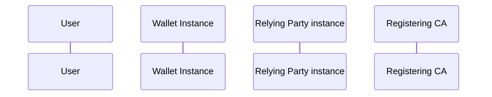

<!-- ARF version: v2.8.0 -->
<!-- Tokens: ~4874 -->

##### 6.6.3.1 Required trust relationships

A Relying Party can request a User to present some attributes from a PID or from
an attestation in their Wallet Unit. [Figure 12](#61-scope) shows that a Relying
Party uses a Relying Party Instance to interact with the Wallet Unit of the
User. The relationship between the Relying Party and their Relying Party
Instance is similar to the relationship between the User and their Wallet Unit.

When processing the request, the following trust relationships are established:

1. The Wallet Unit authenticates the Relying Party Instance, ensuring the User
about the Relying Party's identity. [Section
6.6.3.2](#6632-wallet-unit-authenticates-the-relying-party-instance) explains
how this will be done.
2. The Wallet Unit verifies that the Relying Party does not request more
attributes than it has registered for, and informs the User about the outcome of
this verification. See [Section 6.6.3.3](#6633-wallet-unit-allows-user-to-verify-that-relying-party-does-not-request-more-attributes-than-it-registered)
for more information.
3. The Attestation Provider, during issuance, may optionally embedded a
disclosure policy in the attestation. If such a policy is present for the
requested attestation, the Wallet Unit evaluates the disclosure policy and
informs the User about the outcome of this evaluation. See [Section 6.6.3.4](#6634-wallet-unit-evaluates-embedded-disclosure-policy-if-present).
4. The User approves or rejects the presentation of the requested attributes.
User approval and selective disclosure are described in [Section 6.6.3.5](#6635-wallet-unit-obtains-user-approval-for-presenting-selected-attributes).
Subsequently, after the Wallet Unit presents the selected attributes from the
PID or attestation to the Relying Party Instance by sending a response to the
request, the Relying Party validates the response. The following trust
relationships are established:
5. The Relying Party Instance verifies the signature of the PID or attestation.
This ensures that the Relying Party can trust that the PID or attestation it
receives is issued by an authentic Provider and has not been changed. This is
described in [Section 6.6.3.6](#6636-relying-party-instance-verifies-the-authenticity-of-the-pid-or-attestation).
6. The Relying Party verifies that the PID Provider or Attestation Provider did
not revoke the PID or attestation. This is described in [Section 6.6.3.7](#6637-relying-party-verifies-that-the-pid-or-attestation-is-not-revoked).
7. For PIDs and device-bound attestations, the Relying Party verifies that the
PID Provider or Attestation Provider issued this PID or attestation to the same
Wallet Unit that presented it to the Relying Party. In other words, it checks
that the PID or attestation was not copied or replayed. This is generally called
device binding, and it is discussed in [Section 6.6.3.8](#6638-relying-party-instance-verifies-device-binding)
8. In some use cases, the Relying Party verifies that the person presenting the
PID or attestation is the User to whom the PID or the attestation was issued.
This is called User binding. In other use cases, the Relying Party trusts that
the Wallet Unit and/or the WSCA/WSCD have done this check. User binding is
discussed in [Section 6.6.3.9](#6639-relying-party-instance-verifies-or-trusts-user-binding).
9. The Relying Party can request attributes from two or more attestations in the
same interaction. This is called a **combined presentation of attributes**. If
so, the Relying Party verifies that these attestations belong to the same User.
This is discussed in [Section 6.6.3.10](#66310-relying-party-instance-verifies-combined-presentation-of-attributes).
10. Finally, after the interaction with the Relying Party Instance is over, the
Wallet Unit enables the User to report unlawful or suspicious requests for
personal data by a Relying Party, based on information logged by the Wallet
Unit. In addition, the Wallet Unit enables the User to send a request to a
Relying Party to delete personal data (i.e., User attributes) obtained from the
Wallet Unit. This is discussed in [Section 6.6.3.13](#66313-wallet-unit-enables-the-user-to-report-suspicious-requests-by-a-relying-party-and-to-request-a-relying-party-to-erase-personal-data).

##### 6.6.3.2 Wallet Unit authenticates the Relying Party Instance

Relying Party authentication is a process whereby a Relying Party proves its
identity to a Wallet Unit, in the context of an interaction in which the Relying
Party requests the Wallet Unit to present some attributes. Relying Party
authentication is discussed in [Topic 6](./annexes/annex-2/annex-2.02-high-level-requirements-by-topic.md#a234-topic-6---relying-party-authentication-and-user-approval).

Relying Party authentication is included in the protocol used by a Wallet Unit
and a Relying Party Instance to communicate. As documented in [Topic 12](./annexes/annex-2/annex-2.02-high-level-requirements-by-topic.md#a239-topic-12---attestation-rulebooks),
at least two different protocols can be used within the EUDI Wallet ecosystem,
namely the ones specified in [ISO/IEC 18013-5] and [OpenID4VP]. Both protocols
include functionality allowing the Wallet Unit to authenticate the Relying Party
Instance. Although these protocols differ in the details, on a high level, they
both implement Relying Party authentication as shown in Figure 12 below.

Figure 13 High-level overview of Relying Party authentication process

The figure shows the following:

First, there are two preconditions that need to be fulfilled before the Relying
Party authentication process can begin. Note that these actions are not carried
out for every presentation, but only once (excluding possible updates):

A) The Relying Party registered itself as described in
[Section 6.4.2](#642-relying-party-registration)
and obtained an access certificate for each of its Relying Party Instances.

B) The Wallet Unit obtained the trust anchor of the Access Certificate Authority from the respective List of Trusted Entities (LoTE).

Subsequently, during each presentation of attributes:

1. The Relying Party Instance prepares a request for some attributes to the
Wallet Unit and includes its access certificate in the
request, plus all intermediate certificates up to (but excluding) the trust anchor.
1. The Relying Party Instance signs some data in the attribute request using its
private key.
1. The Relying Party Instance sends the request to the Wallet Unit.
1. The Wallet Unit checks the authenticity of the request by verifying the
signature over the request using the public key in the access certificate.
1. The Wallet Unit checks the authenticity of the Relying Party by validating
the access certificate and all intermediate certificates
included in the request. For validating the last intermediate certificate, the
Wallet Unit uses the trust anchor it obtained from the LoTE in step B above.
1. The Wallet Unit validates that none of the certificates in the trust chain
have been revoked. This includes the access certificate
as well as all other certificates in the trust chain, including the trust anchor
itself if applicable.
1. The Wallet Unit continues by requesting the User for approval.
1. The User approves the attributes that will be presented.
1. The Wallet Unit sends a response containing only the approved attributes to
the Relying Party Instance.

##### 6.6.3.3 Wallet Unit allows User to verify that Relying Party does not request more attributes than it registered

During registration, the Relying Party registered which attributes it intends to
request from Wallet Units for each of the services (intended uses) it has. If
the Registrar issues registration certificates, the Registrar listed these
attributes in a separate certificate for each intended use and sent it to the
Relying Party. Subsequently, the Relying Party distributed these to all of its
Relying Party Instances. Finally, the Relying Party Instance sent a single
registration certificate pertaining to the intended use relevant for the current
presentation request to the Wallet Unit in the request.

Note that a single intended use may cover multiple attributes from multiple
attestations. For example, a Relying Party selling alcoholic beverages online
may register that for this intended use they will request an age verification
attribute from the PID and a User address from some other attestation. However,
if a Relying Party really has multiple intended uses for interacting with a
Wallet Unit, it needs to send multiple presentation requests, each including the
relevant registration certificate.

As a general setting or when processing a presentation request, the Wallet Unit
offers to the User an option to verify the information registered for the
Relying Party. If the User chooses to do so, the Wallet Unit obtains information
about which attributes the Relying Party registered:

- If a registration certificate is included in the request, the Wallet Unit
gets this information from the certificate.
- If no registration certificate is
available, the Wallet Unit contacts the Registrar to obtain this information. To
do so, the Wallet Unit needs the following:

    - the URL of the Registrar's online service,
    - the unique identifier of the Relying Party,
    - the identifier of the intended use of the Relying Party for this
    presentation request. This is needed because the list of registered attributes
    depends on the intended use. As specified in [Technical Specification 5](./technical-specifications/ts5-common-formats-and-api-for-rp-registration-information.md),
    the Registrar assigns a unique identifier to each intended use of a Relying
    Party during registration.

  The Wallet Unit can retrieve these pieces of information from the extension of
  the presentation request discussed in [Section 6.6.3.5.3](#66353-wallet-unit-informs-the-user-about-the-identity-of-the-relying-party).

Once it has retrieved the list of attributes registered by the Relying Party,
the Wallet Unit compares this list to the attributes that the Relying Party
requests in the presentation request. The Wallet Unit notifies the User in case
the Relying Party requested attributes that it has not registered at the
Registrar, when asking the User for approval, see [Section 6.6.3.5](#6635-wallet-unit-obtains-user-approval-for-presenting-selected-attributes).
The Wallet Unit also notifies the User in case the Wallet Unit is not able to
retrieve the Relying Party registration information.

The format of the registration certificate, as well as the way in which the
Wallet Unit can verify that the registration certificate belongs to the
authenticated Relying Party, will be specified in a technical specification. For
more information, see [Topic 44](./annexes/annex-2/annex-2.02-high-level-requirements-by-topic.md#a2326-topic-44---relying-party-registration-certificates).

##### 6.6.3.4 Wallet Unit evaluates embedded disclosure policy, if present

During attestation issuance, an Attestation Provider optionally created an embedded
disclosure policy for the attestation, see [Section 6.6.2.7](#6627-provisioning-embedded-disclosure-policies).
If such a policy is present for the requested attestation, the Wallet Unit
evaluates the policy, together with information in the access certificate, to
determine whether the Attestation Provider allows this Relying Party to receive
the requested attestation. Note that the Wallet Unit verifies the authenticity
of the access certificate before using any data contained in it.

The Wallet Unit presents the outcome of the disclosure policy evaluation to the
User when requesting User approval, see [Section 6.6.3.5.7](#66357-wallet-unit-informed-the-user-about-the-outcome-of-the-evaluation-of-the-embedded-disclosure-policy).
For example, "The issuer of your medical data does not want you to present data
from \<attestation name\> to \<Relying Party name\>. Do you want to continue?"
Note that the User can overrule the disclosure policy evaluation outcome.

For more details on the embedded disclosure policy, see [Topic 43](./annexes/annex-2/annex-2.02-high-level-requirements-by-topic.md#a2325-topic-43---embedded-disclosure-policies).

##### 6.6.3.5 Wallet Unit obtains User approval for presenting selected attributes

###### 6.6.3.5.1 Introduction

**Note: In this document the term 'User approval' exclusively refers to a User's
decision to present an attribute to a Relying Party. Under no circumstances
User approval to present data from their Wallet Unit should be construed as
lawful grounds for the processing of personal data by the Relying Party or any
other entity. A Relying Party requesting or processing personal data from a
Wallet Unit must ensure that it has grounds for lawful processing of that data,
according to Article 6 of the GDPR.**

Before presenting any attribute to a Relying Party, the Wallet Unit requests the
User for their approval. This is critical for ensuring that the User remains in
control of their attributes.

A Wallet Unit requests User approval in all use cases, both in proximity flow
and remote flow, and including:

- Use cases where the Relying Party could be assumed to be trusted, for example,
when the Relying Party is part of law enforcement or another government agency.
- Use cases where the requested attributes are critical for the Relying Party to
grant access to the User or deliver the requested services.
- Use cases where there is, according to the GDPR or other legislation, no legal
need to ask for the User's approval because another legal basis exists for
requesting the attributes.

A number of conditions must be fulfilled for effective User approval:

1. The Wallet Unit authenticated the User; see [Section 6.6.3.5.2](#66352-wallet-unit-authenticates-the-user),
2. The Wallet Unit informed the User about the identity of the Relying Party and
about the identity of the intermediary, if applicable; see [Section 6.6.3.5.3](#66353-wallet-unit-informs-the-user-about-the-identity-of-the-relying-party),
3. The Wallet Unit informed the User about the attributes the Relying Party requested,
4. The Wallet Unit informed the User about the Relying Party's intended use and
privacy policy for these attributes,
5. The Wallet Unit informed the User about the outcome of the evaluation of the
requested attributes,
6. The Wallet Unit informed the User about the outcome of the evaluation of the
embedded disclosure policy, if any,
7. The Wallet Unit enables the User to approve or deny the requested attributes.

These conditions are further discussed in the next subsections. After the User
gives their approval, the Wallet Unit will present the approved User attributes
to the Relying Party Instance.

High-level requirements regarding User approval can be found in [Topic 6](./annexes/annex-2/annex-2.02-high-level-requirements-by-topic.md#a234-topic-6---relying-party-authentication-and-user-approval)

###### 6.6.3.5.2 Wallet Unit authenticates the User

A prerequisite for requesting User approval is that the Wallet Unit is sure that
the person using the Wallet Unit (and giving the approval) is in fact the User.
Therefore, the WSCA/WSCD authenticates the User prior to or during requesting
User approval, on request of the Wallet Unit. To do so, the Wallet Unit uses one
of the User authentication mechanisms set up during Wallet Unit activation, see
[Section 6.5.3.3](#6533-wallet-unit-requests-user-to-set-up-two-user-authentication-mechanisms).

###### 6.6.3.5.3 Wallet Unit informs the User about the identity of the Relying Party

In order to be able to give approval, a User needs to be informed about the
identity of the Relying Party. The Wallet Unit shows the User at least the
User-friendly name and the unique identifier registered by the Relying Party.

The Wallet Unit obtains this information from the extension of the presentation
request (see requirement RPRC_19a in [Topic 44](./annexes/annex-2/annex-2.02-high-level-requirements-by-topic.md#a2326-topic-44---registration-certificates-for-pid-providers-providers-of-qeaas-pub-eaas-and-non-qualified-eaas-and-relying-parties)
in Annex 2), or from the registration certificate, if presented by the Relying
Party Instance.

If the Relying Party uses an intermediary (see [Section 3.11.3](#3113-intermediaries)),
the Wallet Unit informs the User also about the name and the unique identifier
of the intermediary. In this case, the name and identifier of the intermediary
are included in the access certificate presented by the Relying Party Instance,
whereas the name and identifier of the intermediated Relying Party are included
in the extension of the presentation request and in the registration certificate
if available. If these names and identifiers are different, the Wallet Unit
knows that the presentation request is from an intermediary on behalf of an
intermediated Relying Party.

###### 6.6.3.5.4 Wallet Unit informs the User about the attributes the Relying Party requested

In order to be able to give approval, a User also needs to know which attributes
the Relying Party wishes to receive. Note that a Relying Party may request
attributes from multiple attestations in a single request; for example
information from a diploma and from a PID.

###### 6.6.3.5.5 Wallet Unit informs the User about the Relying Party's intended use and privacy policy

According to the GDPR, a User must be informed about the Relying Party's
intended use for the requested attributes. For each presentation request, the
Relying Party can have only one intended use. If the Relying Party has multiple
intended uses for requesting attributes from a Wallet Unit, it needs to send
multiple presentation requests. In such a case, the Wallet Unit will request the
User for their approval multiple times.

If the Relying Party Instance sends a registration certificate to the Wallet
Unit in the presentation request, this certificate contains a User-friendly
description of the Relying Party's intended use, as well as a URL to the
applicable privacy policy of the Relying Party. The Wallet Unit shows this
information to the User.

Regardless of whether there is a registration certificate, the Relying Party
Instance in any case includes the User-friendly description of the Relying
Party's intended use in the presentation request, so that the Wallet Unit can
show it to the User. In addition, if the User wants, the Wallet Unit will
retrieve the information registered about the Relying Party from the respective
Registrar. This information includes a URL to the applicable privacy policy of
the Relying Party. The Wallet Unit then shows this URL to the User.

###### 6.6.3.5.6 Wallet Unit informs the User about the outcome of the evaluation of the requested attributes

[Section 6.6.3.3](#6633-wallet-unit-allows-user-to-verify-that-relying-party-does-not-request-more-attributes-than-it-registered)
above described how the Wallet Unit can verify the attributes requested by the
Relying Party against the attributes that the Relying Party registered for the
given intended use. The Wallet Unit will perform this verification only if the
User desires this. If the Wallet Unit performed this verification and the
outcome is negative, the Wallet Unit will inform the User that this is the case.
For example, "\<Relying Party name\> requested \<attribute1\>, but it did not
register this attribute. Do you want to continue?" Note that the User can
overrule a negative outcome of this verification and decide to approve the
request.

###### 6.6.3.5.7 Wallet Unit informed the User about the outcome of the evaluation of the embedded disclosure policy

[Section 6.6.3.4](#6634-wallet-unit-evaluates-embedded-disclosure-policy-if-present)
above described that an Attestation Provider can add an embedded disclosure
policy for an attestation. It also described how a Wallet Unit can evaluate such
a policy. The Wallet Unit presents the outcome of the disclosure policy
evaluation to the User when asking for User approval. For example, "The issuer
of your \<attestation name\> does not want you to present data to \<Relying
Party name\>. Do you want to continue?" Note that the User can overrule a
negative outcome of the disclosure policy evaluation and decide to approve the
request.

###### 6.6.3.5.8 Wallet Unit enables the User to approve or deny the requested attributes

After presenting all of the above information to the User, the Wallet Unit
enables the User to approve or deny the requested attributes. Preferably, the
User gives approval either to present all attributes requested, or none of them.
This is because partial approval would mean that the Relying Party cannot
deliver the service, but nevertheless receives some User attributes. This would
be a violation of the User's privacy. Note that a Relying Party is not allowed
to request more data than is justified for the intended use. Therefore, if the
User feels that the Relying Party is actually requesting more data than needed,
that implies that the Relying Party is not trustworthy. The User should not
approve the presentation of any data in that case.

The Wallet Unit will present the all approved User attributes, and only these,
to the Relying Party Instance.
