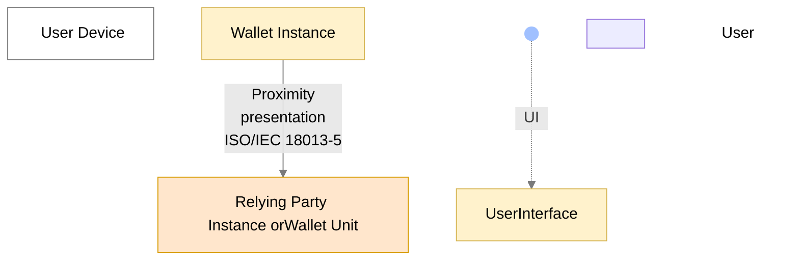
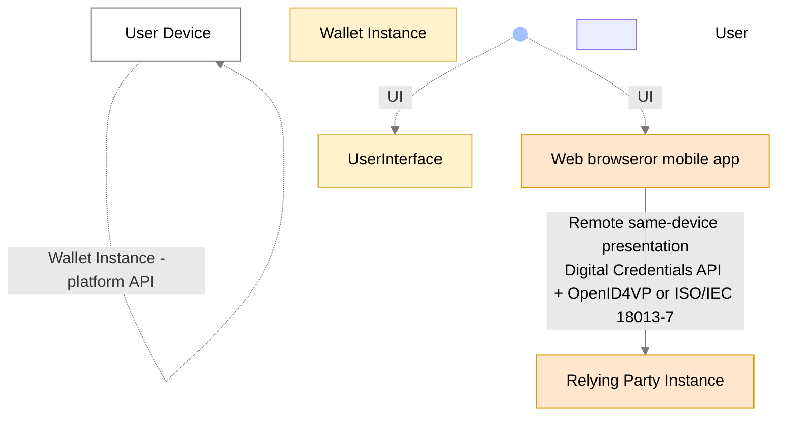
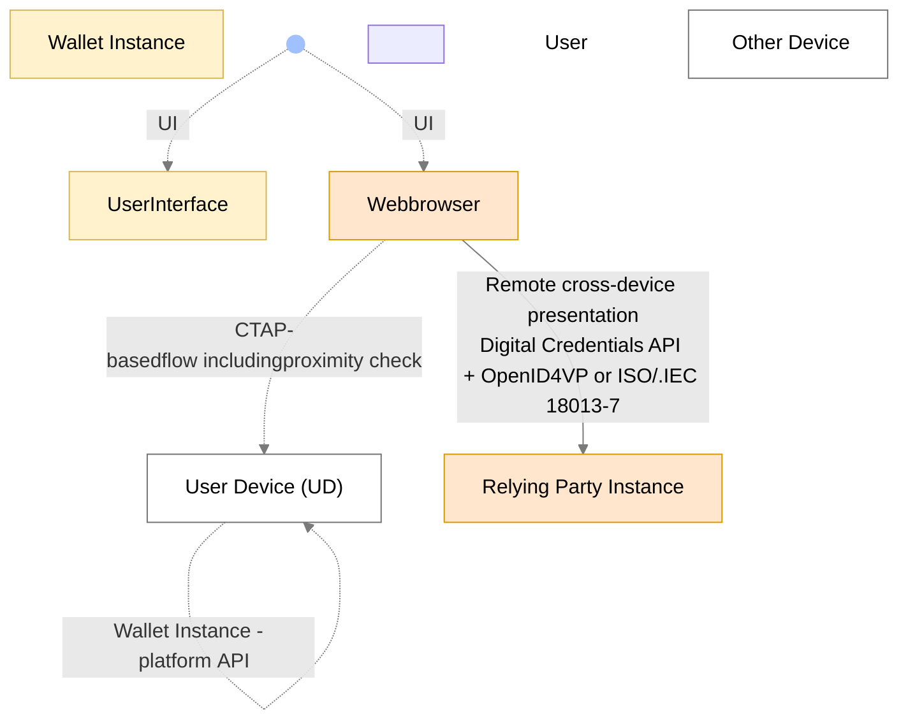

<!-- ARF version: v3.0.0 -->
<!-- Tokens: ~7688 -->

### 4.4 Data presentation flows

#### 4.4.1 Overview

This section defines four distinct communication flows that can be used when a
Wallet Unit presents a PID or attestation to a Relying Party Instance:

- **Proximity Supervised Flow**: In this flow, the User and their User
device are physically near the Relying Party Instance. PIDs and attestations
are exchanged using proximity technology (e.g., NFC or Bluetooth) between the
Wallet Unit and the Relying Party Instance. Both devices may be with or without
internet connectivity. A human representative of the Relying Party supervises
the process.
- **Proximity Unsupervised Flow**: This flow is like the supervised flow, but
the Wallet Unit presents attestations to a machine, without human supervision.
The interfaces and protocols used in this flow are the same as for the proximity
supervised flow, and are described in [Section 4.4.2][442-proximity-presentation-flows].
- **Remote Same-Device Flow**: In this flow, the User uses a web browser or
another application on their User device to access a Relying Party's service.
The service requires the Relying Party to obtain specific
attributes from the User's Wallet Unit, and therefore the Relying Party sends a presentation request to the Wallet Unit. As explained in [Section 4.4.3.1][4431-introduction], the transmission channel to send the request and the response are set up either using custom URIs, or via the web browser on the User's device, using the [W3C Digital Credentials API]. [Section 4.4.3.4][4434-same-device-remote-presentation-flows-using-the-digital-credentials-api] explains the latter option in more detail.
- **Remote Cross-Device Flow**: In this flow, the User uses a web browser on a
device other than the User device on which their Wallet Unit is installed to
access the Relying Party's service. This other device could be a
desktop, laptop, or another mobile device. Like with same-device flows, the communication channel between the other device
and the User's device is set up either by using custom URIs, or by using the [W3C Digital Credentials API]. [Section 4.4.3.5][4435-cross-device-remote-presentation-flows-using-the-digital-credentials-api] explains the latter option in more detail.

Specific use cases integrate one or more of these flows. Each of these flows is
described in more detail in one of the next sections.

#### 4.4.2 Proximity presentation flows

Figure 3 shows how attestation presentation works when the User and their User
Device are physically near the Relying Party Instance and do not have (or do not
want to use) an internet connection between them. In this case, the [ISO/IEC
18013-5] standard specifies how a communication channel is set up and how a
presentation request and the corresponding response are exchanged using
short-range communication technologies.

*Figure 3: Proximity presentations*

An attribute presentation flow according to [ISO/IEC 18013-5] begins when the User
opens the Wallet Instance and instructs it to display a QR code or present an
NFC tag. This QR code or NFC tag contains the information necessary to establish
an NFC, BLE, or Wi-Fi Aware connection. The Relying Party Instance scans the QR
code or the NFC tag and sets up a connection towards the Wallet Unit. The QR
code or NFC tag also contains the information necessary to create an
authenticated and encrypted secure channel on top of the NFC, BLE, or Wi-Fi
Aware connection between both entities.

For more information about the protocol and transmission mechanism specified in [ISO/IEC 18013-5], please see [Section 5.7.2][572-proximity-attestation-presentation-using-isoiec-18013-5]. For high-level requirements, see [Topic 24][topic-24].

Note that a Wallet Unit and a Relying Party do not necessarily use proximity
technologies if they are close together. They are free to use a remote
flow according to [Section 4.4.3][443-remote-presentation-transaction-flows].
However, there may be situations where either the Wallet Unit or the Relying
Party Instance does not have an internet connection. In such cases, Wallet Units
must be able to use a proximity presentation flow, if it is close to a Relying
Party Instance supporting the [ISO/IEC 18013-5] standard.

#### 4.4.3 Remote presentation transaction flows

##### 4.4.3.1 Introduction

Remote presentation transaction flows are use cases in which the Relying Party
Instance is remote from the User and the User device. The Relying Party Instance
requests data from the Wallet Unit over the internet. There are two main mechanisms that can be used to set up a transmission channel between a Wallet Unit and a remote Relying Party Instance:

- Using a custom URI.
- Using a mediating API implemented in the browser and/or the OS of the User device. The only specification of such an API that is currently available is the [W3C Digital Credentials API].

Wallet Units support both mechanisms, although the use of custom URI schemes is not recommended for cross-device flows, due to the challenges described in the next section. Moreover, support for the custom URI scheme specified in [ISO/IEC 18013-7] is optional. For detailed high-level requirements, please refer to [Topic 1][topic-1].

A remote **same-device** attribute presentation flow using **custom URIs** begins when the User accesses the Relying Party's website using a browser on their device. The website may provide an option for the User to present attributes from their Wallet Unit, typically via a button or similar interface. When the User selects this option, the browser sends a URI using a custom URI scheme, such as openid4vp:// or mdoc://, to the OS of the User device. The URI contains the URL of the remote Relying Party Instance. The Wallet Unit has registered for receiving URIs of these custom schemes. Therefore, the OS will invoke the Wallet Unit and send it the URI. The Wallet Unit connects to the remote Relying Party Instance at the URL in the custom URI.

Note: A similar approach is to use domain-bound universal links, also known as app links. This has the drawback that such a link can be used only for a specific Wallet Solution. In other words, a Relying Party Instance, when trying to set up a connection to a Wallet Unit, must know upfront who is the Wallet Provider of that Wallet Unit.

A **cross-device** attribute presentation flow using **custom URIs** begins when the User uses a browser on a device different from their User device to visit the website of the Relying Party. The website may offer the User the possibility to present
attributes from their Wallet Unit, for example by presenting a QR code. If the User scans this QR code using an app on their User device, that app sends a URI using a custom URI scheme to the OS of the User device. The remainder of the flow is identical to the same-device flow, as described in the previous paragraph.

Remote **same-device** presentation flows using the **[W3C Digital Credentials API]** are described in [Section 4.4.3.4][4434-same-device-remote-presentation-flows-using-the-digital-credentials-api].

Remote **cross-device** presentation flows using the **[W3C Digital Credentials API]** are described in [Section 4.4.3.5][4435-cross-device-remote-presentation-flows-using-the-digital-credentials-api].

##### 4.4.3.2 Challenges for remote presentation flows using custom URIs

Remote presentation flows, when implemented over transmission channels set up using custom URIs (as described in the previous section) come with a number of challenges that are not present for proximity flows:

1. **Secure Cross-Device Flows**: Cross-device flows are vulnerable to phishing
and relay attacks, necessitating enhanced security measures. Proximity checks
managed by the operating system of the User device can mitigate the risks
derived from these vulnerabilities, ensuring they are both secure and
reliable.
1. **Wallet Unit Selection**: In remote flows, interactions
do not originate from the Wallet Unit but from the remote Relying Party Instance. Users may encounter difficulties in
selecting the appropriate Wallet Unit to fulfil a specific
presentation request, particularly when multiple Wallet Units are present on the
device. A unified interface provided by the web browser and the device operating
system can streamline this process, offering a seamless and intuitive User
experience.
1. **Invocation Mechanism**: Establishing a communication channel between the
Wallet Unit and the remote Relying Party Instance using custom URI schemes presents challenges due to
inconsistent invocation methods. User
experiences across different browsers and operating systems may be different, resulting in
operational inefficiencies and potential security risks.
1. **Clear Origin Verification**: Protecting against relay attacks requires the Wallet Unit to have precise
identification of the Relying Party Instance's origin. Including the origin
information, such as the website domain or app package name, within the
presentation request ensures the authenticity of the request and enhances trust
for both Wallet Units and Users.
1. **Session binding**: When presenting a PID or attestation to a remote Relying
Party Instance, Users have to switch contexts. Using custom URIs to set up the connection to the Wallet Unit may enable
attacks where the contexts are not bound to each other, resulting in session
hijacking. Using an interface provided by the web browser and the device OS
allows information about a session to be embedded in a presentation request. This enables the browser and the operating system to handle context
switching properly, preventing session hijacking.

The next sections describe how these challenges might be solved for both
same-device and cross-device remote presentation flows by using the [W3C
Digital Credentials API].

##### 4.4.3.3 The [W3C Digital Credentials API]

###### 4.4.3.3.1 Overview

The current version of the [W3C Digital Credentials API] extends the Credential Management
Level 1 API (the same API used by WebAuthn / Passkeys (see [Section 4.7][47-possible-implementations-of-pseudonyms]))
to allow websites to request an attestation. This is achieved by providing a
sequence of "presentation requests", where each presentation request includes an
"exchange protocol" and "request data". The format of the request data is
specific to the exchange protocol. The [W3C Digital Credentials API] specifications
will include a registry of supported protocols. For more information see the
[Topic F: Digital Credentials API](../discussion-topics/f-digital-credential-api.md)
discussion paper.

The [W3C Digital Credentials API] is still under development and
has not yet been released as a W3C Recommendation. It is currently a W3C Working Draft. Moreover, the API has not been implemented yet by all browsers and operating
systems. Although support of this API by
Wallet Units is mandatory, Relying Parties may choose to use custom URL schemes to set up remote connections.
If a Wallet Unit implements a custom URL scheme, it will need to implement
mitigations for the challenges described in this section.

Implementations of the [W3C Digital Credentials API] by browsers and operating systems will have to align with the expectations outlined in [Section 4.4.3.3.2][44332-expectations-for-implementations-of-the-digital-credentials-api]. Similarly, implementations of the underlying CTAP protocol will have to align with the expectations outlined in [Section 4.4.3.3.3][44333-expectations-for-implementations-of-the-ctap-protocol-in-cross-device-flows].

###### 4.4.3.3.2 Expectations for implementations of the Digital Credentials API

If the transmission channel between the Relying Party Instance and the Wallet Unit is set up via the operating system and/or the browser using the [W3C Digital Credentials API], the Relying Party's presentation request will be processed by the browser and/or the operating system for searching available attestations, for preventing fraud targeting the User, or for troubleshooting purposes. Moreover, the request may be processed for User security purposes. However, the request will not be processed by the browser and/or the operating system for market analysis purposes (including as a secondary purpose) or for the browser's and/or the operating system's own purposes.

In particular, implementations of the [W3C Digital Credentials API] must meet critical expectations regarding functionality, neutrality, privacy, and availability.

- **Functionality**: Implementations support both Wallet Unit selection and invocation for attestation presentation and issuance. They support the protocols specified in the Implementing Acts for remote
presentation and issuance. They also enable secure cross-device flows
to mitigate phishing and relay attacks.
- **Technological neutrality**: Implementations preserve neutrality, avoiding
vendor-specific extensions. Implementations do not restrict, block, or
discriminate against specific protocols, credential formats, or attestation
types. Any EUDI Wallet Solution will be able to use a Digital Credentials API implementation, without additional vendor vetting.
- **Privacy and responsibility**: Implementations do not compromise User privacy. The
Wallet Unit remains solely responsible for requesting User approval. The Wallet
Unit retains full responsibility over attestation management, ensuring the
operating system does not override or disrupt the Wallet Unit's security functions. The
attestation matching mechanism used by the operating system are
privacy-preserving, only accessing the minimum necessary information without
disclosing attributes or values.
- **Availability**: Implementations prevent Denial-of-Service attacks against Wallet
Units by ensuring Attestation Providers or Relying Parties cannot send multiple
invalid requests.

###### 4.4.3.3.3 Expectations for implementations of the CTAP protocol in cross-device flows

For cross-device flows, implementations of the CTAP protocol underlying the Digital Credentials API also meet specific requirements:

- **Mandatory proximity check**: The Wallet Unit verifies that the device interacting with the Wallet Unit is in close physical proximity to the User's device, using a secure, direct, and user-mediated local communication channel (such as a short-range wireless technology). In [CTAP] terms, this proximity check is the BLE proximity engagement, present in both the Hybrid transport in [CTAP] v2.2 and in [CTAP] v2.3. The Wallet Unit does not continue the transaction if the proximity check does not succeed. 
- **Transport preference**: Where both devices support it, the underlying operating systems, browsers, mediating APIs, or any other technical layer outside the control of the Wallet Unit, should prefer performing both the proximity check and the data transfer over a local short-range channel (as enabled by [CTAP] v2.3) over the use of a Hybrid tunnel service first defined in [CTAP] v2.2. Where the fully-local path is not supported by both devices, CTAP-Hybrid with a tunnel server remains an acceptable fallback for the data transfer. However, this is out of scope of the ARF.

##### 4.4.3.4 Same-device remote presentation flows using the Digital Credentials API

###### 4.4.3.4.1 Using a web browser

*Figure 4: Remote same-device presentations*

Compared to Figure 2, Figure 4 shows additional detail. In particular, it shows
the browser on the User device and the relevant interfaces of this browser:

- The **Remote same-device presentation** interface establishes communication
between the web browser and a remote Relying Party Instance, which may operate
on a server managed by the Relying Party. This interface complies with the
[W3C Digital Credentials API].
- The **Wallet Instance-platform API** interface is a mechanism provided by the device's
operating system that may implement the [W3C Digital Credentials API] mechanism at OS
level. There are however no current plans to standardise this interface on the
level of the API calls. These calls will be specified in the developer
documentation for the respective OS. One of the main properties of this API is
that a Wallet Unit receives reliable information regarding the origin of the
presentation request.

Obviously, the browser also has a User interface allowing the User to interact
with it. This interface will not be standardised in the context of the EUDI
Wallet ecosystem.

A remote same-device attribute presentation flow using the Digital Credentials API begins when the User accesses
the Relying Party's website using a browser on their device. The website may
provide an option for the User to present attributes from their Wallet Unit,
typically via a button or similar interface. When the User selects this option,
the browser may ask the User for permission to initiate the presentation flow. Upon
granting permission, the Relying Party Instance sends a presentation request
compliant with the [OpenID4VP] specification to the browser via the Digital
Credentials API. The browser, working in tandem with the device's operating
system (OS), forwards the request to the Wallet Unit using the Wallet Instance-platform API.
If the device hosts multiple Wallet Units, the browser and OS will determine
which Wallet Unit handles the request. To enable the browser and the OS to do this, the request is unencrypted. The selection decision may involve
consulting the User.

The selected Wallet Unit processes the presentation request and seeks the
User's approval before returning the requested attributes in an encrypted format
to the browser. The browser then forwards this encrypted response to the remote
Relying Party Instance.

###### 4.4.3.4.2 Using a mobile app

Figure 4 also illustrates an inter-app attribute presentation flow. In this
scenario, an application on the User's device, such as a banking or shopping
app, interacts with the Wallet Unit over the Wallet Instance-platform API. This app acts as
the Relying Party Instance, possibly in cooperation with a remote server of the
entity that provisioned the app. The app can use the User attributes retrieved
from the Wallet Unit itself, for example for User authentication or to
automatically fill in data fields like User name and address. Alternatively, the
app can send these User attributes to the remote server. All requirements on
Relying Parties in this ARF, such as those regarding Relying Party registration
and authentication, User approval, and other aspects, are applicable in this use
case as well.

In this use case, the attribute presentation flow begins when the User opens the
app and initiates a request for attributes from the Wallet Unit via the
WI-platform API. Notably, this is the same API used in remote same-device
presentation flow involving a browser. The primary difference lies in the origin
information included in the presentation request, which may vary.

##### 4.4.3.5 Cross-device remote presentation flows using the Digital Credentials API

Figure 5: Remote cross-device presentations

A remote cross-device attribute presentation flow using the Digital Credentials API begins when the User uses a
browser on a device different from their User device to visit the website of the
Relying Party. The website may offer the User the possibility to present
attributes from their Wallet Unit, for example by clicking a button. If the User
does so, the browser may ask the User for permission to initiate the
presentation flow. If the User allows this, the Relying Party Instance sends a
presentation request to the browser over the [W3C Digital Credentials API]. The
browser then establishes a tunnel towards the User device, using the FIDO CTAP
hybrid flow, see section 11.5 of [CTAP]. Note that this flow is also used
for FIDO Passkeys. This is done as follows:

 1. The browser presents a QR code that includes information about the tunnel
 endpoint, as well as keys that will be used for establishing a secure channel
 over this tunnel.
 2. The User scans the QR code using the camera on the User device.
 3. The User device emits a BLE advertisement, which is received by the browser.
 The advertisement includes, in an encrypted form, information required for
 establishing the secure tunnel. This advertisement is used as a proximity
 check: the tunnel cannot be established if the User device and the device on
 which the browser runs are not close to each other.
 4. A tunnel is established between the two devices.

The browser then sends the [OpenID4VP]-compliant presentation request to the User
device. If there are multiple Wallet Instances present on the User device, the
device OS will determine to which of these the request will be forwarded,
possibly after consulting the User. The selected Wallet Unit will process the
presentation request and, after requesting approval from the User, will return
the requested attributes in encrypted format to the browser, using the
established tunnel. The browser will forward the response to the remote Relying
Party Instance.

Note that the Wallet Instance does not see any difference between the
cross-device flow and the same-device flow. In both cases, it receives an
OpenID4VP-compliant presentation request over the Wallet Instance-platform API described in
the previous section.

The proximity check in step 3 is mandatory for cross-device flows (see [Section 4.4.3.3.3][44333-expectations-for-implementations-of-the-ctap-protocol-in-cross-device-flows]). The flow described above carries the presentation request and response
over the CTAP-Hybrid tunnel. Where both devices support [CTAP] v2.3, the proximity
check and the data transfer may instead both be carried over a local short-range
channel without a tunnel server. This fully-local option should be preferred over
the CTAP-Hybrid tunnel services, which however remain an acceptable fallback.

---

### 5.6 Catalogue of attributes and catalogue of attestation schemes

#### 5.6.1 Introduction

[Article 45e(2) of Regulation (EU) 2024/1183](https://eur-lex.europa.eu/legal-content/EN/ALL/?uri=CELEX:32024R1183#d1e3883-1-1)
empowers the Commission to establish **specifications and procedures** for: (i)
the **catalogue of attributes**, (ii) the **catalogue of attestation schemes**,
and (iii) **verification procedures** for qualified electronic attestations of
attributes.

The objective of this provision is to reach a high level of interoperability:

- **Technical interoperability** through common standards, protocols, and
technical specifications enabling issuance, presentation, and processing of
attestations (see [Sections 5.4][54-technical-attestation-formats-and-proof-mechanisms] and
[5.7][57-protocols-and-transmission-mechanisms-for-attestation-presentation]).
- **Semantic interoperability** through clear definitions of
attestation contents, i.e., which attributes exist for each attestation type and
their identifiers, syntax, and semantics (see [Section 5.5][55-attestation-rulebooks-and-attestation-schemes]).

To support discovery and re-use across the EUDI Wallet ecosystem, two
Commission-run catalogues are defined:

- a **Catalogue of attributes** that draws on authentic public-sector sources
(see [Section 5.6.2][562-catalogue-of-attributes]); and
- a **Catalogue of attestation schemes** for QEAAs, PuB-EAAs, and EAAs (see
[Section 5.6.3][563-catalogue-of-attestation-schemes]).

#### 5.6.2 Catalogue of attributes

The catalogue of attributes is exclusively intended for use by QTSPs issuing
QEAAs, and enables them to find the access point of the Authentic Source
responsible for a given attribute, at which the QTSP can verify the value of that
attribute for a given User. This verification is discussed in [Topic 42][topic-42]
in Annex 2.

See [Topic 25][topic-25]
and [Commission Implementing Regulation 2025/1569](http://data.europa.eu/eli/reg_impl/2025/1569/oj),
particularly Article 7, for the high-level requirements for the catalogue of attributes.

For more details, see also the [Discussion Paper on Topic O](../discussion-topics/o-catalogues-for-attestations.md).
Detailed interface specifications for registering and managing attributes in the
catalogue and for querying the catalogue can be found in
[Technical Specification 11](../technical-specifications/ts11-interfaces-and-formats-for-catalogue-of-attributes-and-catalogue-of-schemes.md).

#### 5.6.3 Catalogue of attestation schemes

The catalogue of attestation schemes is intended for use by Relying Parties,
Attestation Providers, and other actors in the EUDI Wallet ecosystem. It enables
them to discover which types of attestations already exist within the ecosystem,
and to understand the identifiers, syntax, and semantics of all attributes
within each type of attestation.

This section defines the following principles for the catalogue of attestation schemes:

- Attestation schemes are machine-readable, and each attestation scheme
published in the catalogue refers to the corresponding human-readable
Attestation Rulebook.
- Attestation schemes for QEAAs and PuB-EAAs used within the EUDI Wallet
ecosystem may be registered and published in the catalogue of attestation
schemes, but this is not mandatory.
- The catalogue of attestation schemes may also include attestation schemes for
non-qualified EAAs. Registration and publication of non-qualified EEAs is not mandatory.
- The Commission will take measures to establish and maintain the catalogue of
attestation schemes.
- The catalogue of attestation schemes will be publicly accessible.
- Registration of attestation scheme in the catalogue does not create any
obligation for acceptance of the relevant type of attestation by any actor in
the EUDI Wallet ecosystem. Neither does it automatically imply cross-border
recognition of the type of attestation.
- Where possible, existing tools created by Member States, the
Commission and cross-border organisations, will be used to connect to the
catalogue and to interact with its stakeholders. Also, mechanisms to add new and
existing data sets to the catalogue will be implemented.

See [Commission Implementing Regulation 2025/1569](http://data.europa.eu/eli/reg_impl/2025/1569/oj),
particularly Article 8, for the high-level requirements for the catalogue of attestation schemes.

For more details, see also the [Discussion Paper on Topic O](../discussion-topics/o-catalogues-for-attestations.md).
Detailed interface specifications for registering and managing attestation
schemes in the catalogue and for querying the catalogue can be found in
[Technical Specification 11](../technical-specifications/ts11-interfaces-and-formats-for-catalogue-of-attributes-and-catalogue-of-schemes.md).
