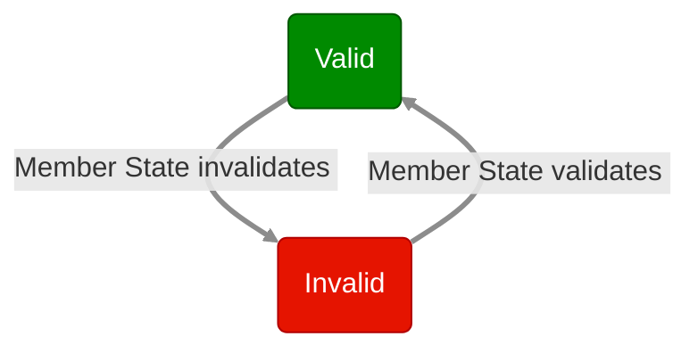
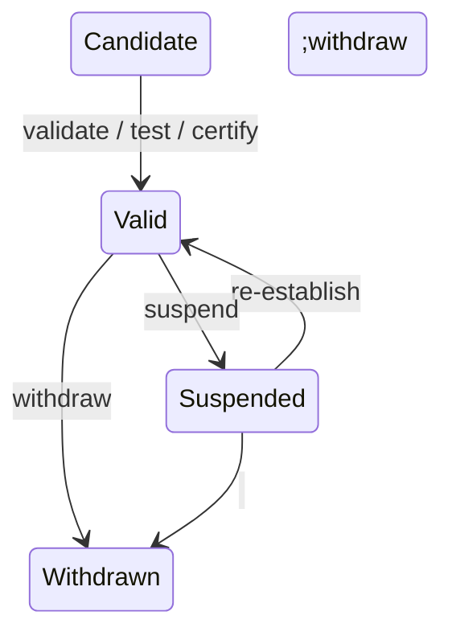
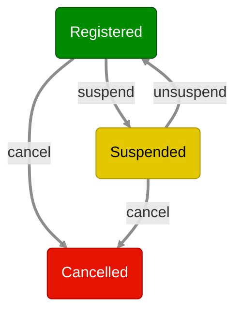
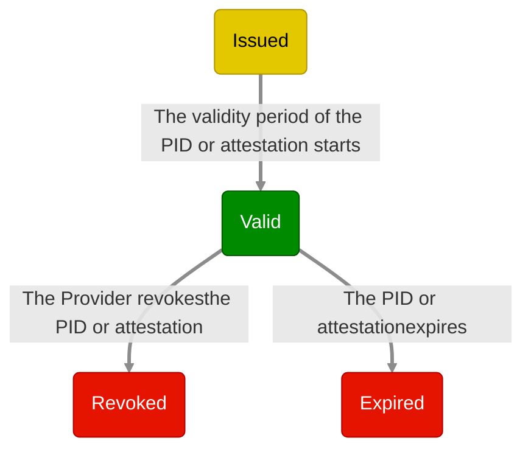

<!-- ARF version: v3.0.0 -->
<!-- Tokens: ~10360(LARGE) -->

### 4.5 WSCD architecture types

#### 4.5.1 Introduction

[Figure 2][431-overview] shows four different types of architecture for the
WSCD, which are:

- Remote WSCD, see [Section 4.5.2][452-remote-wscd]
- Local external WSCD, see [Section 4.5.3][453-local-external-wscd]
- Local internal WSCD, see [Section 4.5.4][454-local-internal-wscd]
- Local native WSCD, see [Section 4.5.5][455-local-native-wscd]

Within the EUDI Wallet ecosystem, a Wallet Provider is allowed to
use any of these architectures.

For more information, please refer to the [Discussion Paper for Topic P](../discussion-topics/p-secure-cryptographic-interface-between-the-Wallet-Instance-and-WSCA.md).

Notes:

- Regardless of the chosen architecture, the Wallet Provider is responsible for
ensuring that the Wallet Instance can access a WSCA/WSCD with a security level
sufficient to meet **Level of Assurance High**, as required by the [European
Digital Identity Regulation] for PIDs. Although this section discusses a few
specific WSCD architectures and technologies, this does not necessarily imply
that a given implementation of these architectures or technologies will be able
to pass the required security certification.
- The Wallet Provider manages the
cryptographic keys on the WSCD (through the WSCA) throughout the lifetime of the
Wallet Unit, and attest the properties of the WSCD, including relevant
certifications, in a Key Attestation (KA). See [Section 6.5.3.4][6534-wallet-provider-issues-one-or-more-key-attestations-to-the-wallet-unit].
- User access to the WSCA/WSCD always requires **two User authentication
mechanisms**, one implemented by the User's device OS (possibly augmented by a Wallet Instance-specific PIN), and the other by the
WSCA/WSCD, irrespective of the architecture used. See [Section 6.5.3.3][6533-wallet-unit-requests-user-to-set-up-two-user-authentication-mechanisms].
  
#### 4.5.2 Remote WSCD

In this architecture, the Wallet Secure Cryptographic Device is situated
remotely from the User device. Typically, it will be implemented by the Wallet
Provider using an HSM running on a secure server. The Wallet Provider will also
provide the WSCA with which the Wallet Unit interacts. The WSCA does not
necessary run (fully) on the HSM hardware.

This architecture is typically used if the User device lacks sufficiently secure
hardware, or if the Wallet Provider does not want to have a dependency on such
hardware.

If a remote HSM is used as the WSCA/WSCD, the Wallet Provider takes appropriate measures to ensure that only the legitimate Wallet Instance can access the remote HSM and use the critical assets of the Wallet Unit. The Wallet Provider may do so, for example, by using a split-key architecture, where the keys at the side of Wallet Instance are stored and managed in an embedded Secure Element or other keystore. During the certification process, the security of the HSM access control solution will be evaluated.

#### 4.5.3 Local external WSCD

If the User device lacks sufficiently secure hardware, another option is to use
a local external hardware component as the WSCD. This local external WSCD is
typically a smart card or a secure token. It is connected to the User device via
NFC or another short-range connection, and is able to perform all of the
cryptographic operations required from a WSCA/WSCD in the ARF. Note that many
existing smart cards, such as identity cards, will not be able to do this.

The WSCA typically takes the form of a Java Card applet. The WSCA is installed
prior to issuance of the smart card or secure token to the User. The issuer of
the WSCD and of the WSCA is the Wallet Provider or another entity acting on
behalf of or in cooperation with the Wallet Provider.

#### 4.5.4 Local internal WSCD

In this architecture, the Wallet Secure Cryptographic Device is integrated
directly within the User's device. This includes solutions like UICCs,
e-SIM/SAMs, or embedded Secure Elements. Such solutions typically are compliant
with the GlobalPlatform Card Specifications [GP CS] or with the GSMA Secured
Applications for Mobile [GSMA SAM] specification.

The WSCA will typically be a Java Card applet, and it is remotely issued to the
WSCD by the Wallet Provider, at the moment the Wallet Unit is activated; see
[Section 6.5.3][653-wallet-unit-activation]. In order to do this, the Wallet
Provider may need to connect to and collaborate with other entities, such as a
Trusted Service Manager employed by the owner of the WSCD.

A local internal WSCD is typically not provided by the Wallet Provider. However,
the Wallet Provider is responsible for verifying that the local internal WSCD is
compliant with all applicable requirements, in particular regarding security
certification. In this regard, [CIR 2024/2981], Annex IV, (3) states:
  > When the WSCA is not provided by the wallet provider, national certification
  schemes shall formulate assumptions for this evaluation of the WSCA under
  which resistance against attackers with high attack potential in accordance
  with Implementing Regulation (EU) 2015/1502 [...]
  
  This implies that a local internal WSCD may be covered by an assumption
  regarding its resistance against attackers with high attack potential. This
  assumption can be based, for instance, on a security evaluation of the local
  internal WSCD by a third party.

#### 4.5.5 Local native WSCD

A local native WSCD is integrated into the User device, just like the local
internal WSCD discussed in the previous section. However, the API to access the
WSCD is included in the operating system of the User device. Therefore, no
separate WSCA is necessary. Alternatively, the API offered by the OS may be
viewed as the WSCA.

The Wallet Provider is responsible for verifying that the local native WSCD is
compliant with all applicable requirements, in particular regarding security
certification. In this regard, the statements regarding certification of local
internal WSCDs in the previous section apply to local native WSCDs as well.

### 4.6 State diagrams

#### 4.6.1 Introduction

In this section, state diagrams are presented for Wallet Solutions, Wallet
Units, PID Providers and Attestation Providers, PIDs and attestations, and
Relying Parties.

#### 4.6.2 Wallet Provider

Figure 6 shows the possible states of a Wallet Provider.




Figure 6: State diagram of Wallet Provider

The **Valid** state is the first state of a Wallet Provider. This means it has
been notified by a Member State to the Commission, as described in [Section 6.2.2][622-wallet-provider-notification])
and in [CIR 2024/2980] Annex II, 2.
This notification includes the certified Wallet Solution(s) provided by the
Wallet Provider.

If the Member State notifies the Commission that the notified entity is no longer a valid Wallet Provider, the Wallet Provider moves to the state **Invalid**.

#### 4.6.3 Wallet Solution

A Wallet Solution has a state diagram of its own, independent of the lifecycle of the associated Wallet Provider. The state of a Wallet Solution
affects the state of all Wallet Units of that Wallet Solution. Figure 7 below
shows the states of the Wallet Solution:




Figure 7: State diagram of Wallet Solution

The **Candidate** state is the first state of a Wallet Solution. This means it
is fully implemented and the Wallet Provider requests the solution to be
certified as a Wallet Solution as part of an EUDI Wallet eID scheme.

If all the legal and technical criteria have been met, a Member State may decide
to allow a Wallet Provider to start providing the Wallet Solution to Users. The
Member State notifies its Supervisory Body of the issuance of a certificate of
conformity of the Wallet Solution (see [CIR 2024/2981]). The state of the Wallet
Solution becomes **Valid**. This means the Wallet Solution can be officially
launched, and can be provided to Users. The issuing Member State informs the
Commission of each change in the certification status of their EUDI Wallet eID
scheme and the Wallet Solutions provided under that scheme.

The issuing Member State can temporarily suspend a Wallet Solution. This would
for example be the result of a critical security issue. This leads to the
**Suspended** state. The issuing Member State can re-establish the Wallet Solution,
bringing the Solution back to the **Valid** state. The issuing Member State can
also decide to withdraw the Wallet Solution, which brings the Wallet
Solution in the **Withdrawn** state. This state change cannot be undone.

Article 5e of the [European Digital Identity Regulation] requires Wallet
Providers, in case of a security issue, to first "suspend the provision and the
use of European Digital Identity Wallets" and to "withdraw [them] and revoke
their validity" only if the issue cannot be solved within three months. [CIR
2025/847] interprets this as applying to Wallet Solutions, not Wallet Units.
Wallet Units can only be revoked. When a Wallet Solution is suspended, according to [CIR 2025/847] Article 4, point 2, the
Member State decides whether it is necessary to revoke the corresponding
Wallet Units. If it decides not to, the Wallet Units continue functioning
normally. If it decides to revoke its Wallet Units, these Wallet Units cannot
request the issuance of a PID or attestation any more. Also, PID Providers will
revoke their PIDs on such Wallet Units, and other Attestation Providers may
similarly revoke their attestations. If a Wallet Solution is withdrawn, the
Wallet Provider revokes all associated Wallet Units.

#### 4.6.4 Wallet Unit

Figure 8 below shows the states of a Wallet Unit.


```mermaid
flowchart TD
n0xPVAkh8Ksko_M2C2wA4D_1("Installed")
n0xPVAkh8Ksko_M2C2wA4D_2("Valid")
n0xPVAkh8Ksko_M2C2wA4D_4("Uninstalled")
n0xPVAkh8Ksko_M2C2wA4D_17("Operational")
n08AVNub2K3lThiEOuCoSU_1("Revoked")
n0xPVAkh8Ksko_M2C2wA4D_2 -->|The User uninstallsthe Wallet Instance| n0xPVAkh8Ksko_M2C2wA4D_4
n0xPVAkh8Ksko_M2C2wA4D_2 -->|The PID expires,&nbsp;the PID Provider revokes the PID,or the User deletes the PID| n0xPVAkh8Ksko_M2C2wA4D_17
n0xPVAkh8Ksko_M2C2wA4D_17 -->|The User uninstallsthe Wallet Instance| n0xPVAkh8Ksko_M2C2wA4D_4
n0xPVAkh8Ksko_M2C2wA4D_2 -->|The Wallet Providerrevokes the Wallet Instance| n08AVNub2K3lThiEOuCoSU_1
n0xPVAkh8Ksko_M2C2wA4D_1 -->|The User activates the Wallet UnitThe Wallet Provider issues first KA(s) and WIA(s)| n0xPVAkh8Ksko_M2C2wA4D_17
n0xPVAkh8Ksko_M2C2wA4D_17 -->|The PID Providerissues a new PID| n0xPVAkh8Ksko_M2C2wA4D_2
n0xPVAkh8Ksko_M2C2wA4D_1 -->|The User uninstallsthe Wallet Instance| n0xPVAkh8Ksko_M2C2wA4D_4
n0xPVAkh8Ksko_M2C2wA4D_17 -->|The Wallet Providerrevokes the Wallet Instance| n08AVNub2K3lThiEOuCoSU_1
n08AVNub2K3lThiEOuCoSU_1 -->|The User&nbsp;uninstallsthe Wallet Instance| n0xPVAkh8Ksko_M2C2wA4D_4

style n0xPVAkh8Ksko_M2C2wA4D_1 stroke: #C73500,color: #ffffff,fill: #ff6a00
style n0xPVAkh8Ksko_M2C2wA4D_2 stroke: #005700,color: #ffffff,fill: #008a00
style n0xPVAkh8Ksko_M2C2wA4D_4 stroke: #B20000,color: #ffffff,fill: #e51400
style n0xPVAkh8Ksko_M2C2wA4D_17 stroke: #B09500,color: #000000,fill: #e3c800
style n08AVNub2K3lThiEOuCoSU_1 stroke: #B20000,color: #ffffff,fill: #e51400
linkStyle 0 stroke-width: 3,stroke: #8c8c8c
linkStyle 1 stroke-width: 3,stroke: #8c8c8c
linkStyle 2 stroke-width: 3,stroke: #8c8c8c
linkStyle 3 stroke-width: 3,stroke: #8c8c8c
linkStyle 4 stroke-width: 3,stroke: #8c8c8c
linkStyle 5 stroke-width: 3,stroke: #8c8c8c
linkStyle 6 stroke-width: 3,stroke: #8c8c8c
linkStyle 7 stroke-width: 3,stroke: #8c8c8c
linkStyle 8 stroke-width: 3,stroke: #8c8c8c
```

Figure 8: State diagram of Wallet Unit

A Wallet Unit lifecycle begins when the User installs a Wallet Instance on their
User device, see [Section 6.5.2][652-wallet-instance-installation]. The Wallet
Unit's state is then **Installed**. In this state, the User and the Wallet
Provider can perform only one action, namely activating the Wallet Unit, as
described in [Section 6.5.3][653-wallet-unit-activation]. As part of the
activation process, the Wallet Provider issues one or more Key Attestations (KA, see [Section 6.5.3.4][6534-wallet-provider-issues-one-or-more-key-attestations-to-the-wallet-unit]) and Wallet Instance Attestations (WIA, see [Section 6.5.3.5][6535-wallet-provider-issues-one-or-more-wias-to-the-wallet-unit]) to the Wallet Unit.

Once a Wallet Unit is activated, it is in the **Operational** state. If, in the
**Operational** state, a PID Provider issues a PID to a Wallet Unit, it
transitions to the **Valid** state. If, in either of these two states, the
Wallet Provider revokes the Wallet Instance or revokes the WSCD or a keystore of the Wallet Unit, the Wallet Unit moves to the **Revoked** state. Revocation cannot be undone.

If, in the **Valid** state the last or only PID in the Wallet Unit expires, is
revoked, or is deleted, the Wallet Unit's state is moved back to
**Operational**. Note that if there are multiple PIDs in the Wallet Unit, it
does not move to the **Operational** state as long as at least one of them is
valid.

In the **Valid** state, the following actions can be performed:

- The Wallet Provider updates the Wallet Unit to a new version,
- The User requests issuance of a PID, a QEAA, a PuB-EAA, or an EAA.
- The User views the PID(s) and attestation(s) in their Wallet Unit, including their attribute values.
- The User views the transaction log (see [Section 6.6.3.13][66313-wallet-unit-enables-the-user-to-report-suspicious-requests-by-a-relying-party-and-to-request-a-relying-party-to-erase-personal-data]) and optionally report suspicious requests by a Relying Party to a Data Protection Agency, or requests a Relying Party to erase personal data.
- The User presents attributes from a PID, a QEAA, a PuB-EAA, or an EAA to a
Relying Party.
- The User deletes a PID, a QEAA, a PuB-EAA, or an EAA.
- The Wallet Provider revokes the Wallet Unit, for instance at the User's
request or if the security of the Wallet Instance is broken. Revocation of the
Wallet Unit is accomplished by revoking the Wallet Instance, using a status list referenced  in the WIA. The Wallet Provider can also revoke the WSCD or a keystore that is part of the Wallet Unit, using a status list referenced in the corresponding Key Attestation; see
[Topic 9][topic-9]
and [Topic 38][topic-38].
- A PID, a QEAA, a PuB-EAA, or an EAA is revoked by its Provider (if it is valid
for more than 24 hours).
- The User uninstalls the Wallet Instance.

In the **Operational** state, the same actions can be performed as in the
**Valid** state. However, obviously, the User cannot present a PID to a Relying
Party, nor can any other action with a PID be performed, because by definition
no valid PID is present in this state.

Note that in the **Operational** and **Valid** states, the Wallet Provider ensures that the Wallet Unit can always present a valid WIA and KA to a PID Provider or Attestation Provider. For that reason, Figure 8 does not contain an **Expired** state. However, if the Wallet Provider fails to ensure this, all of the actions listed above can still be performed, except for the User requesting the issuance of a PID or attestation.

In the **Revoked** state, the same actions can be performed as in the
**Operational** state, except:

- the User cannot request issuance of a PID or attestation.
- the User cannot present a valid PID, since PID Providers will revoke any PIDs that
reside on a revoked Wallet Unit.
- the User cannot present any valid attestation for which the Attestation Providers
similarly decides to revoke any attestations that reside on a revoked Wallet
Unit.

#### 4.6.5 PID Provider or Attestation Provider

Figure 9 shows the possible states of a PID Provider or Attestation Provider.




Figure 9: State diagram of PID Provider or Attestation Provider

The **Registered** state is the first state of a PID Provider or Attestation
Provider. This means it is registered by a Member State Registrar and notified
to the Commission, as described in [Section 6.3.2][632-pid-provider-or-attestation-provider-registration-and-notification].

The Registrar can temporarily suspend a PID Provider or Attestation Provider.
This leads to the **Suspended** state. The Registrar can unsuspend the PID
Provider or Attestation Provider, bringing it back to the
**Registered** state. The Registrar can also decide to completely
cancel registration of the PID Provider or Attestation Provider, which brings it
in the **Cancelled** state. For more information about suspension or
cancellation, please refer to [Section 6.3.3][633-suspension-or-cancellation-of-the-registration-of-a-pid-provider-or-attestation-provider]).
A PID Provider or Attestation Provider with suspended or cancelled registration
cannot issue PIDs or attestations to Wallet Units, nor will a PID or attestation
issued by such a PID Provider or Attestation Provider be accepted by Relying
Parties.

#### 4.6.6 PID or attestation

Figure 10 shows the possible states of a PID or attestation.

In the context of the EUDI Wallet ecosystem, a PID or attestation begins its
lifecycle when being issued to a Wallet Unit. Please note that this means that
the management of attributes in the Authentic Source (adhering to national
structures and attribute definitions) is outside the scope of the ARF.

For certain use cases, a PID or attestation may be pre-provisioned, meaning it
is not yet valid when issued. In that case, its state is **Issued**, and it will
transition to **Valid** when it reaches the beginning of its validity period.
However, if a PID or attestation is issued on or after the validity start date,
its state directly changes to **Valid**.




Figure 10: State diagram of PID or attestation

There are two possible transitions for a valid PID or attestation: it expires by
passing through the validity end date and transitions to the **Expired** state,
or it is revoked by its PID Provider or Attestation Provider, ending up in the
**Revoked** state. Expiration and revocation are independent transitions. Once a
PID or attestation is expired or revoked, it cannot transition back to
**Valid**.

#### 4.6.7 Relying Party

Figure 11 shows the possible states of a Relying Party.


Figure 11: State diagram of Relying Party

The **Registered** state is the first state of a Relying Party. This means it has
been registered by a Registrar, as described in [Section 6.4.2][642-relying-party-registration].

The Registrar can suspend registration of a Relying Party. This leads to the
**Suspended** state. The Registrar can unsuspend the Relying Party, bringing it
back to the **Registered** state. The Registrar can also decide to completely
cancel registration of the Relying Party, which brings it
in the **Cancelled** state. For more information about suspension or cancellation,
please refer to [Section 6.4.3][643-relying-party-suspension-or-cancellation].
A Wallet Unit will not present a PID or attestation to a Relying Party that has its
registration suspended or cancelled.

### 4.7 Possible implementations of pseudonyms

#### 4.7.1 Introduction: types of pseudonyms

[Section 2.5][25-pseudonyms] discussed four different use cases for pseudonyms, which can potentially be supported in the EUDI Wallet ecosystem. This section introduces three different types of pseudonyms that could potentially be used in the EUDI Wallet ecosystem to achieve these use cases:

- **Verifiable pseudonym:** A verifiable pseudonym is a pseudonym that allows a User to prove possession over the pseudonym and thereby authenticate as the pseudonym. [Section 4.7.2][472-verifiable-pseudonyms] discusses how a Wallet Unit could support a specific type of verifiable pseudonyms called Passkeys.
- **Attested pseudonym:** An attested pseudonym is a subtype of a verifiable pseudonym, allowing Relying Parties to verify that a third party has attested that a pseudonym is owned by a User. Within the EUDI Wallet ecosystem, this third party would be an Attestation Provider, who issues pseudonym attestations in the form of a (Q)EAA or PuB-EAA. [Section 4.7.3][473-attested-pseudonyms] discusses how attested pseudonyms can be issued within the EUDI Wallet ecosystem.
- **Scope rate-limited pseudonym:** A scope rate-limited pseudonym is a subtype of a verifiable pseudonym guaranteeing that the User is limited to control only a certain number of pseudonyms (called the rate) for a given scope. A special case occurs when the rate is set to 1. In that case, each User is guaranteed to have at most one valid pseudonym within the relevant scope, for example, in an electronic voting system. This is often referred to as a scope-unique or scope-exclusive pseudonym. [Section 4.7.4][474-scope-rate-limited-pseudonyms] contains more details.

Verifiable pseudonyms can support use cases A (Pseudonymous authentication) and B (Presentation of attributes with subsequent authentication using pseudonyms).

Attested pseudonyms can similarly support use cases A and B, although the Relying Party cannot determine the value of the pseudonym used for each User, unless it also can acts as a Pseudonym Attestation Provider. By default (meaning without special rules on how a Wallet Unit handles a pseudonym attestation), attested pseudonyms also support use case D (Linkable pseudonymous authentication).

Scope rate-limited pseudonyms can support use case C (Rate-limited participation).

#### 4.7.2 Verifiable pseudonyms

##### 4.7.2.1 Introduction to Passkeys

[W3C WebAuthn] defines the technical specification for a type of verifiable
pseudonyms called Passkeys. Passkeys are a widely used type of credential which
are created and asserted using the WebAuthn API. Within the EUDI Wallet
ecosystem, one option for Wallet Providers to support verifiable pseudonyms is
to let their Wallet Units perform the role of a WebAuthn authenticator as
defined in the [W3C WebAuthn] specification.

Passkeys can be seen as an alternative to passwords. The idea is that a User,
when registering a user account at a service, uses a secure device to generate a
public-private key pair, registers the public key at the service, and can then
subsequently use the private key to authenticate towards the service at later
points in time.

In a bit more detail, the flow for using Passkeys is as follows:

**Registration:**

1. The User generates a public-private key pair and stores both the public and
the private key at their secure device (referred to as an Authenticator).
2. The User registers the public key at the desired Relying Party service.

**Authentication:**

1. When the User wishes to authenticate towards a service, the service will send
them a challenge consisting of a random value.
2. The User uses the private key stored on their Authenticator to sign the
challenge and sends this back to the service.
3. The service verifies that the signature on the challenge can be verified
using the registered public key. If the signature verifies and the origin
matches the expected origin, the User is considered authenticated and thereby
granted access to the service.

##### 4.7.2.2 Introduction to [W3C WebAuthn]

###### 4.7.2.2.1 Overview

[W3C WebAuthn] defines an API for the creation and use of Passkeys.
Conceptually, in addition to the User, there are four different logical
components in this specification:

- **Relying Party Server:** The Relying Party that wishes to offer a service
based on User authentication using Passkeys.
- **Relying Party Client:** The program provided by the Relying Party that runs
in the Client of the User and communicates with the Relying Party Server. The
Relying Party Client is typically some JavaScript code, provided by the Relying
Party, that runs on the Client (i.e., browser).
- **Client:** The client that the User uses to interact with the Relying Party's
server and with the User's authenticator. The Client can be thought of as the
browser that the User uses to access the Relying Party's service. Note that the
Relying Party Client and the Client are two programs that are executed on the
same physical machine.
- **Authenticator:** The device controlled by the User to create, store, and use
the Passkeys. If a Wallet Provider decides to implement pseudonyms in the form of
Passkeys, the Wallet Unit will be the Authenticator.

[W3C WebAuthn] defines a model dividing the responsibilities between these
different entities and defines an interface between the Relying Party Client and
the Client. Additionally, it defines a challenge/response protocol to
authenticate with Passkeys. The interface is referred to as the *WebAuthn API*.
However, [W3C WebAuthn] does not specify how the Authenticator and the Client
must communicate.

[W3C WebAuthn] relies on several different types of identifiers, including:

- **Relying Party ID:** An identifier unique to the Relying Party, which must be
a valid domain string. This what the User will identify the Relying Party by and
let the Authenticator learn which Relying Party is asking for
registration/authentication.
- **Credential ID:** A unique identifier chosen by the Authenticator for each
Passkey.
- **User ID:** An identifier unique to each User, which is assigned by the
Relying Party. This will be provided to the Authenticator when registering a new
Passkey. Subsequently, it will be provided by the Authenticator when
authenticating towards the Relying Party. The Authenticator will keep track of
which Passkeys are available for which User IDs and Relying Party IDs. The
Relying Party keeps track of a User Name for each User ID.
- **User Name:** An alias that may be chosen by the User or the Relying Party
and assigned to a specific Passkey on the Authenticator. This allows the User to
easily distinguish and select which Passkey they want to authenticate with, if
several are present in the Authenticator for the given Relying Party.

The next sections explain how the different components work together to
allow User registration and subsequent authentication using Passkeys.

###### 4.7.2.2.2 Registration

The flow for registering a Passkey in [W3C WebAuthn] is the following:

0. The User requests (out of band of WebAuthn) the Relying Party to create a new
Pseudonym.
1. The Relying Party Server creates a challenge and sends this along with the
User ID, the Relying Party ID, and the User Name to the Relying Party Client.
2. The Relying Party Client forwards the information to the Client using the WebAuthn API.
3. The Client checks that the Relying Party ID is consistent with the caller's
origin and forwards the information to the Authenticator along with other
contextual data.
4. The Authenticator authenticates the User (for example using a PIN or via
biometrics). It then generates a new key pair with a new Credential ID and set
the scope of this to the specific Relying Party ID and User ID. Finally, the
Authenticator may generate an attestation (explained in [Section
4.7.2.2.3][47223-pseudonym-attestation]) and send this, as well as the public key
and its Credential ID, to the Client.
5. The Client then forwards the information to the Relying Party Client that
again forwards it to the Relying Party Server.
6. The Relying Party Server verifies the attestation (if present) and registers
the received public key for this User ID.

Note that the Authenticator stores the public key in a way such that it is
scoped uniquely to a specific Relying Party, aligning with the requirements of
[CIR 2024/2979], Article 14 (2), which states that the pseudonyms must be unique
to each Relying Party.

###### 4.7.2.2.3 Pseudonym attestation

The term 'attestation' is used differently in this section than elsewhere in the ARF. In
the context of Passkeys, the attestation is not about attributes of the User, but rather
about attributes of the Authenticator. The attestation serves to ensure the
Relying Party that they are talking with an Authenticator with certain
attributes. The attestation often takes the form of a signature on the challenge
as well as some other contextual data.

In [W3C WebAuthn], five different types of attestations are mentioned:

- **Basic Attestation:** The Authenticator stores a single master public and
private key. The private key is used to sign all attestations and a certificate
on the public key is included in the attestation data to allow the Relying Party
to verify the signature.

- **Attestation CA:** Similar to the above, in the sense that the Authenticator
stores a single master public and private key. However, instead of using this to
attest Passkeys, the Authenticator uses this to authenticate towards a
Certificate Authority (CA), which is configured to issue certificates to the
Authenticator on multiple attestation key pairs. The Authenticator then uses
these attestation private keys to sign attestations.

- **Anonymisation CA:** Similar to the second bullet above, except that it is
explicit that the Authenticator requests a certificate for a new attestation key
pair per generated Passkey.

- **Self Attestation:** The attestation is signed with the private key of the
newly generated key pair in the Passkey. Note that this does not give any
guarantees for the Relying Party about the Authenticator they are interacting
with.

- **No Attestation Statement:** No attestation is given. Note that this does not
give any guarantees for the Relying Party about the Authenticator they are
interacting with.

Please note that Article 5a (5) a) viii) of the [European Digital Identity
Regulation] states "*European Digital Identity Wallets shall, in particular
support common protocols and interfaces: ... for relying parties to verify the
authenticity and validity of European Digital Identity Wallets;...*". The latter
two forms of attestation do not align with this requirement.
[Section 6.1 of the Discussion Paper for Topic E](../discussion-topics/e-pseudonyms-including-user-authentication-mechanism.md#61-topic-a-privacy-risks-and-mitigations)
discusses how the other three possibilities relate to privacy risks about User
surveillance identified in [Section
7.4.3.5][7435-risks-and-mitigation-measures-related-to-user-privacy].

###### 4.7.2.2.4 Authentication

The flow for authentication using a Passkey following [W3C WebAuthn] is:

1. The Relying Party Server creates a challenge and sends this along with its
Relying Party ID to the Relying Party Client.
2. The Relying Party Client forwards the information to the Client using the
WebAuthn API.
3. The Client checks that the Relying Party ID is consistent with the caller's
origin and forwards the information to the Authenticator along with other
contextual data.
4. The Authenticator authenticates the User (for example using a PIN or via
biometrics). It then prompts the User to select one of the Passkeys scoped to
this Relying Party ID, if there are multiple. For this step the User Name can be
presented to the User. Finally, the Authenticator uses the private key of the
chosen key pair (= Passkey) to sign the challenge as well as some contextual
data including the User ID, Credential ID, and the Relying Party ID. The
Authenticator then sends this to the Client.
5. The Client forwards the information to the Relying Party Client, which again
forwards it to the Relying Party Server.
6. The Relying Party Server verifies the signature with the stored public key
for this User ID and Credential ID, and, depending on the outcome of this
verification, considers the User to be authenticated.

#### 4.7.3 Attested pseudonyms

Within the EUDI Wallet ecosystem, attested pseudonyms can be issued by an
Attestation Provider, in the form of a (device-bound) attestation that contains
one or multiple pseudonym values as attributes. A User can subsequently
authenticate  pseudonymously by presenting that attestation to Relying Parties.

The pseudonym values in a pseudonym attestation can have different properties,
to serve different use cases. A simple case is where each pseudonym is just a
(pseudo-)random number. However, pseudonym values can also be generated by the
Attestation Provider using some cryptographic algorithm that takes the identity
of the User and/or the identity of the Relying Party as input.

There is no EU-wide definition of such an attestation type. Schema Providers are
free to define a type of pseudonym Attestation in an Attestation Rulebook.

#### 4.7.4 Scope rate-limited pseudonyms

This version of the ARF does not specify or reference a protocol and
cryptographic mechanisms to implement scope rate-limited pseudonyms. However,
section E of [Topic 11][topic-11]
contains a set of requirements that such a protocol and cryptographic mechanisms
are expected to comply with.
